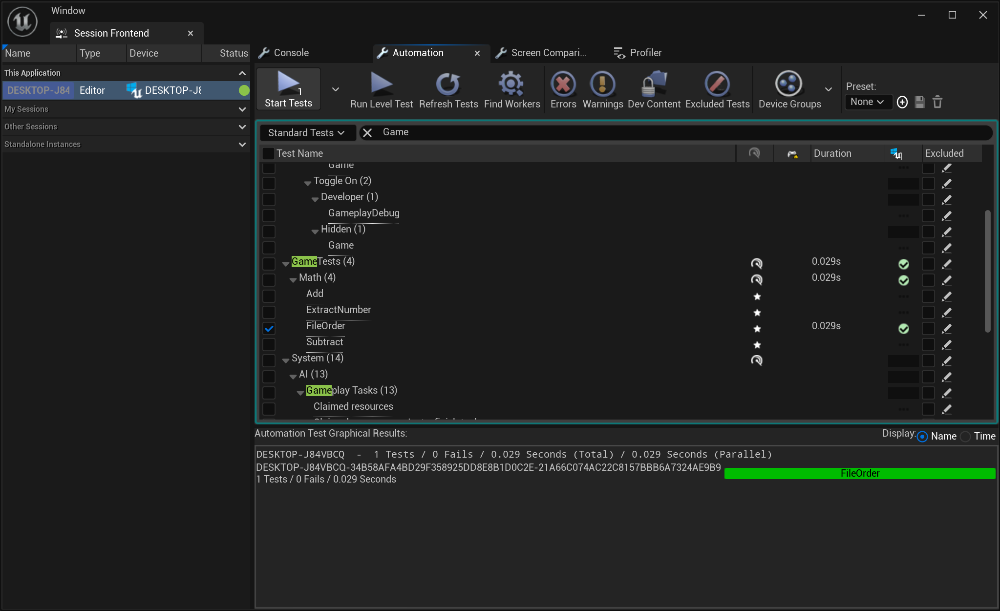

# Maya to Unreal Batch Camera Animation Transfer Tool

This tool facilitates the batch transfer of camera animation data from Maya to Unreal Engine, streamlining the workflow for animators and technical artists. By automating the process, it reduces the manual work involved in exporting and importing multiple camera animations, ensuring efficiency and consistency in the production pipeline.


## Features

- **Batch Processing**: Transfer multiple camera animations from Maya to Unreal Engine in one go.
- **JSON Data Format**: Utilizes JSON for seamless data transfer, ensuring compatibility and easy debugging.
- **Unreal Plugin Integration**: Includes a custom Unreal Engine plugin to automatically generate camera animations based on the imported data.
- **Time-Saving Automation**: Eliminates the need for repetitive manual adjustments, significantly speeding up the workflow.


## Installation

1. **Clone the repository**:
   ```bash
   git clone https://github.com/Ding-Jia-Layla/Maya-to-Unreal-Batch-Camera-Animation-Transfer-Tool.git

2. **Maya**:

- Configure the Plugin Directory:
    - Open the `export.mod` file in a text editor.
    - Modify the directory path to point to the location of your plugin folder. For example, change the path to `.../mayaExport`.
    - Save the changes to `export.mod`.
- Place the Plugin Files:
    - Copy the `export.mod` file and all related plugin files to Maya's `modules` directory. The typical path is:
        - Windows: `C:\Program Files\Autodesk\Maya2023\modules\`
        - macOS/Linux: `/usr/autodesk/maya2023/modules/`
- Load the Plugin in Maya:
    - Open Maya and navigate to the Plug-in Manager:
        - `Windows -> Settings/Preferences -> Plug-in Manager.`
        - Find `animExportPlugin.py` in the list and check both Loaded and Auto load to enable the plugin.

3. **Unreal Engine**:
    - Store Animation Data:
        - Ensure that the animation data (a folder containing the necessary files) is stored in the appropriate directory within the Unreal Engine project's Content directory. The typical path is: `/Game/Content/YourAnimationFolder/`
    - Install the Plugin:
        - Copy the entire `Plugins` folder from this repository to your Unreal Engine project's root directory. If your project already has a `Plugins` folder, simply replace the existing content with the new plugin files.
        - After copying, recompile your Unreal Engine project to ensure the plugin is properly integrated.

## Usage 
1. **Maya**:
    - Prepare the Scene:
        Ensure that the scene is set up with the desired camera and the animation you want to export.
    - Access the Export GUI:
        - Open the Script Editor in Maya.
        - Run the following command to launch the export GUI:`cmds.animExporter()`
    - Export the Animation:
        - In the export GUI, select the output directory where you want to save the exported files.
        - Start the export process and monitor the progress until it reaches 100% to ensure a successful export.
2. **Unreal Engine**:
- Access the Plugin:
    - After recompiling the project in Unreal Engine, go to the Level Sequence List Editor.
- Activate the Plugin:
    - Open the Sequencer Editor in Unreal Engine.
    - Locate and activate the installed plugin from within the editor.
- Import and Generate Animation:
    - Select the folder containing the JSON data that was exported from Maya.
    - Specify the output directory for the sequence to generate the animation data and create the corresponding sequencer in Unreal Engine.

## Examples

- You can check the `example/video.mp4`.

## Test

- Multiple automated tests: 

    - The main test is whether the component is created and the transferred data is correct.

    - 


